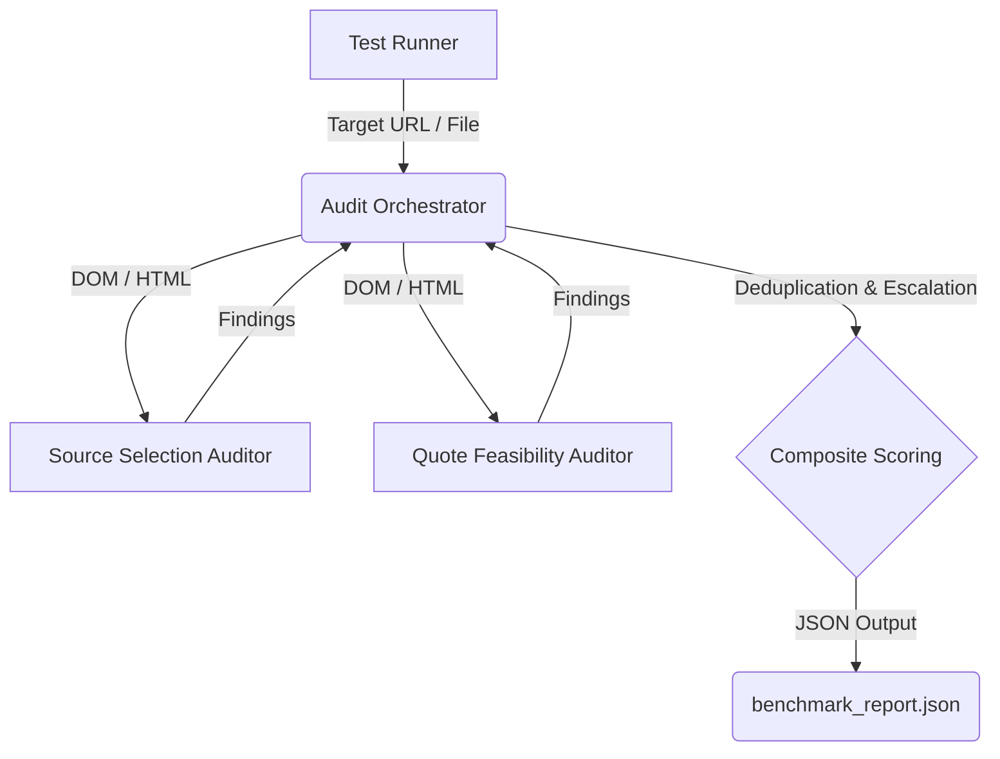

# Brand AI Readiness Audit: AI Discoverability

## Overview
This project provides an automated auditing suite to evaluate how easily LLMs and AI Agents can discover, parse, and utilize information from modern web pages. It specifically assesses **Source Selection** (how well the DOM indicates primary content vs. chrome) and **Quote Feasibility** (how reliably facts can be extracted without losing context).

## Architecture


## Quick Start
1. Ensure you have Python 3.9+ and BeautifulSoup4 installed.
2. Run the master orchestrator on a target URL:
   ```bash
   python skills/audit-orchestrator/scripts/orchestrate.py https://stripe.com/pricing
   ```
3. Run the complete test suite (benchmark URLs + mock pages):
   ```bash
   python tests/test_runner.py
   ```

## Scoring Model
- **Score_composite**: 50% Source Selection Score + 50% Quote Feasibility Score
- **Severity Mapping**:
  - `Critical`: < 0.40
  - `High`: < 0.65
  - `Medium`: < 0.82
  - `Low / Pass`: >= 0.82

## Directory Structure
- `skills/`: Contains the primary auditing logic.
  - `audit-orchestrator/`: Master skill that merges findings.
  - `source-selection-auditor/`: Evaluates structural clarity and semantic HTML.
  - `quote-feasibility-auditor/`: Evaluates text modularity, anaphora, and context bounds.
- `tests/`: Contains the test runner, benchmark URLs, and mock DOM states.
- `outputs/`: Destination for standardized JSON reports.
