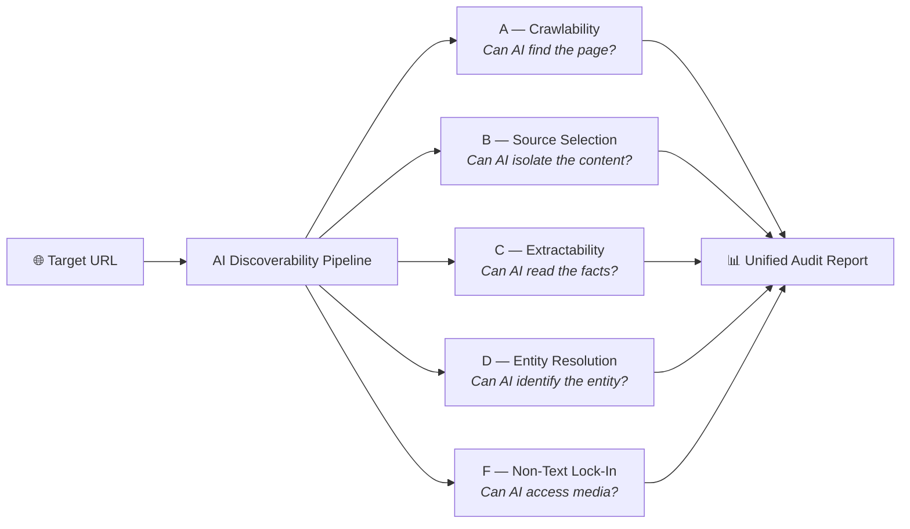

# AI Discoverability — Audit Skill Marketplace

> A comprehensive pipeline of 5 deterministic audit mechanisms that evaluate whether enterprise websites are fully optimized for AI discovery, extraction, and citation.

## Pipeline Architecture



## Mechanism Taxonomy

Each mechanism audits a distinct stage of the AI content consumption pipeline:

| Stage | Mechanism | What It Tests | Hypotheses | Severity if Failed |
|---|---|---|---|---|
| 1. **Crawl** | [A — Crawlability](A-Crawlability/) | robots.txt blocks, link graph gaps, HTTP failures | A-001 to A-003 | 🔴 Page is invisible to AI |
| 2. **Select** | [B — Source Selection](B-Source-Selection/) | Content density, heading locality, quote feasibility | H-SS1 to H-SS3, H-QF1 to H-QF6 | 🟠 AI ingests noise instead of signal |
| 3. **Extract** | [C — Extractability](C-Extractability/) | Render-dependent content, JSON-LD availability, fact-label mapping | C-001 to C-003 | 🟠 AI can't machine-read the facts |
| 4. **Resolve** | [D — Entity Resolution](D-Entity-Resolution/) | JSON-LD identity graphs, sameAs links, name consistency | D-001 to D-004 | 🔴 AI can't identify the entity |
| 5. **Access** | [F — Non-Text Lock-In](F-Non-Text-Lock-In/) | Image alt text, video transcripts, PDF extractability | F-001 to F-003 | 🟡 Media content invisible to AI |

## Cross-Mechanism Dependency Chain

A page must pass each stage to be fully AI-discoverable:

```
A: Crawlable? ──YES──> B: Content isolatable? ──YES──> C: Facts extractable?
       │                        │                              │
       NO                       NO                             NO
       ↓                        ↓                              ↓
   Page invisible          AI gets noise              Facts lost in JS render
   to all AI systems       instead of content          or missing labels

C: Facts extractable? ──YES──> D: Entity resolvable? ──YES──> F: Media accessible?
                                       │                              │
                                       NO                             NO
                                       ↓                              ↓
                                AI can't link entity          Images/PDFs/videos
                                to knowledge graph            are black boxes
```

## Aggregate Scoring Model

Each mechanism produces a **0–1 composite score**. The overall AI Discoverability Score is:

$$Score_{AI} = 0.20 \cdot A + 0.20 \cdot B + 0.25 \cdot C + 0.20 \cdot D + 0.15 \cdot F$$

| Score Range | Severity | Meaning |
|---|---|---|
| < 0.40 | 🔴 **Critical** | Site is fundamentally broken for AI consumption |
| 0.40 – 0.65 | 🟠 **High Risk** | Major gaps in AI discoverability |
| 0.65 – 0.82 | 🟡 **Medium Risk** | Functional but with notable blind spots |
| ≥ 0.82 | 🟢 **AI-Ready** | Site is optimized for AI discovery and citation |

## Quick Start

```bash
# Run ALL mechanisms against a single URL
python ../audit.py https://www.adobe.com

# Run individual mechanisms
python A-Crawlability/scripts/crawlability_report.py https://www.adobe.com
python B-Source-Selection/skills/audit-orchestrator/scripts/orchestrate.py https://stripe.com
python C-Extractability/scripts/extractability_report.py --url https://www.adobe.com
python D-Entity-Resolution/scripts/audit_mechanism_d.py https://www.adobe.com
python F-Non-Text-Lock-In/scripts/non_text_report.py --url https://www.adobe.com
```

## Evidence & Validation

Each mechanism includes:
- **`hypotheses/`** — Formal hypothesis definitions with failure modes and remediation
- **`scripts/`** — Deterministic Python audit scripts (< 5 min runtime per site)
- **`evidence/`** — Generated JSON data from live site testing
- **`FINAL_REPORT.md`** — Human-readable analysis of findings
- **`TRACEABILITY_MATRIX.md`** — Maps each hypothesis to its script, evidence, and status
- **`SKILL.md`** — agentskills.io-compliant skill definition

## Output Schema

All mechanisms produce JSON conforming to this unified schema:

```json
{
  "site": "https://example.com",
  "audited_at": "2026-09-10T12:00:00Z",
  "summary": { "total_findings": 3, "critical": 1, "high": 1, "medium": 1, "low": 0 },
  "findings": [
    {
      "id": "H-SS1",
      "title": "Content Density Ratio",
      "severity": "critical",
      "evidence": "MCDR = 0.18...",
      "suggested_action": { "summary": "...", "priority": "critical" }
    }
  ]
}
```
