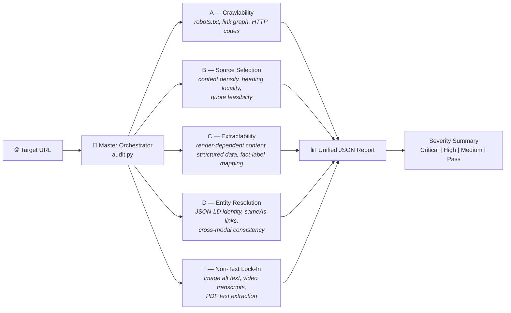

# 🔍 Brand AI Readiness Audit — Agent Skill Marketplace

> **Adobe University Hackathon 2026 — Round 3**
> An end-to-end audit pipeline that evaluates whether enterprise websites are optimized for AI discoverability, machine extraction, and on-site engagement.

---

## Architecture



## Quick Start

```bash
# 1. Clone the repo
git clone https://github.com/vaibhav11rahejaa-sudo/Adobe-Round-3.git
cd Adobe-Round-3

# 2. Install dependencies
pip install -r requirements.txt

# 3. Run full audit on any website
python audit.py https://www.adobe.com

# 4. Run a single mechanism
python "AI Discoverability/D-Entity-Resolution/scripts/audit_mechanism_d.py" https://www.adobe.com
python "AI Discoverability/B-Source-Selection/skills/audit-orchestrator/scripts/orchestrate.py" https://stripe.com
```

## Mechanism Taxonomy

| ID | Mechanism | Pipeline Stage | Hypotheses | Script |
|---|---|---|---|---|
| **A** | Crawlability | Crawl | A-001 to A-003 | `robots_audit.py`, `link_discovery_audit.py`, `url_retrieval_audit.py` |
| **B** | Source Selection & Quote Feasibility | Select + Quote | H-SS1 to H-SS3, H-QF1 to H-QF6 | `evaluate_source_selection.py`, `evaluate_quote_feasibility.py` |
| **C** | Extractability / Machine-Readability | Read + Extract | C-001 to C-003 | `render_compare.py`, `structured_data_compare.py`, `semantic_association_audit.py` |
| **D** | Entity Resolution | Resolve | D-001 to D-004 | `audit_mechanism_d.py` |
| **F** | Non-Text Lock-In | Access | F-001 to F-003 | `image_fact_audit.py`, `visual_media_audit.py`, `document_fact_audit.py` |

## Scoring Model

Each mechanism produces a **0–1 composite score** mapped to severity tiers:

| Score Range | Severity | Meaning |
|---|---|---|
| < 0.40 | 🔴 **Critical** | RAG systems drop or mangle core claims |
| 0.40 – 0.65 | 🟠 **High** | High likelihood of hallucinated context |
| 0.65 – 0.82 | 🟡 **Medium** | Minor qualifying conditions missing |
| ≥ 0.82 | 🟢 **Pass** | Page is AI-ready |

## Output Schema

All mechanisms produce JSON matching this standardized schema:

```json
{
  "site": "https://example.com",
  "audited_at": "2026-09-10T12:00:00Z",
  "summary": {
    "total_findings": 5,
    "critical": 1,
    "high": 2,
    "medium": 1,
    "low": 1
  },
  "findings": [
    {
      "id": "H-SS1",
      "title": "Content Density Ratio",
      "severity": "critical",
      "evidence": "MCDR = 0.18. Page is overwhelmed by boilerplate.",
      "suggested_action": {
        "summary": "Wrap content in <main> tag.",
        "priority": "critical"
      }
    }
  ]
}
```

## Directory Structure

```
Adobe-Round-3/
├── audit.py                          # Master orchestrator — single entrypoint
├── marketplace.json                  # agentskills.io manifest
├── requirements.txt                  # Python dependencies
├── LICENSE                           # MIT License
├── AI Discoverability/
│   ├── A-Crawlability/              # robots.txt, link graph, HTTP retrieval
│   ├── B-Source-Selection/           # Content density, heading locality, quote feasibility
│   ├── C-Extractability/            # Render-dependent content, JSON-LD, fact-label mapping
│   ├── D-Entity-Resolution/         # JSON-LD identity, sameAs, cross-modal consistency
│   └── F-Non-Text-Lock-In/          # Image alt, video transcripts, PDF extraction
└── On-Site Engagement/              # UX engagement metrics (teammate-owned)
```

## Team

Built for the Adobe University Hackathon 2026 — Round 3 (Build the Agent Skill Marketplace).

## License

MIT — see [LICENSE](LICENSE) for details.
